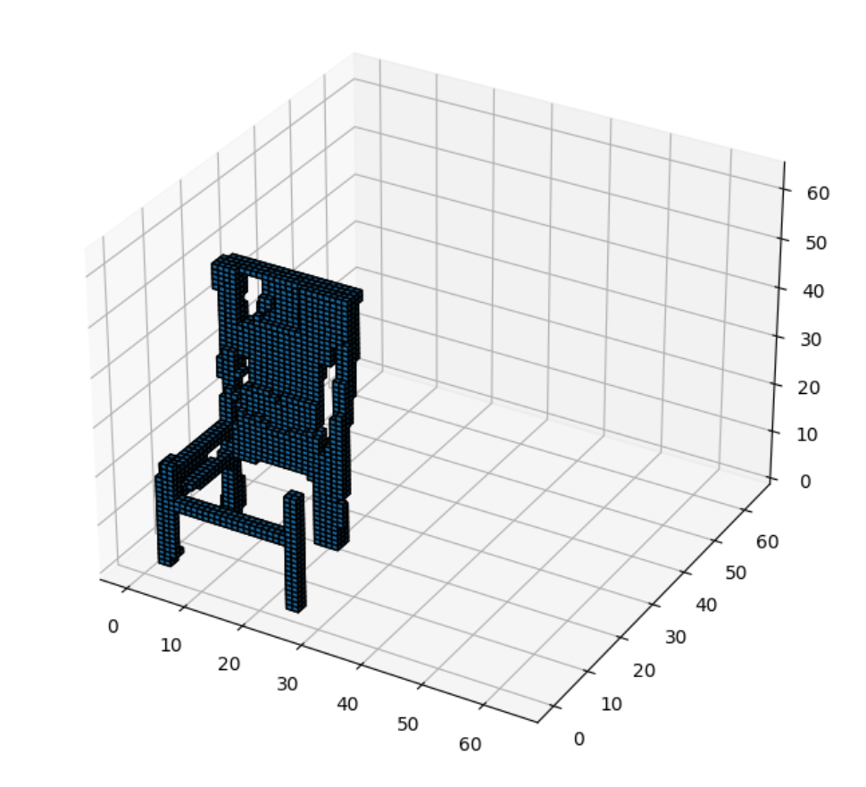
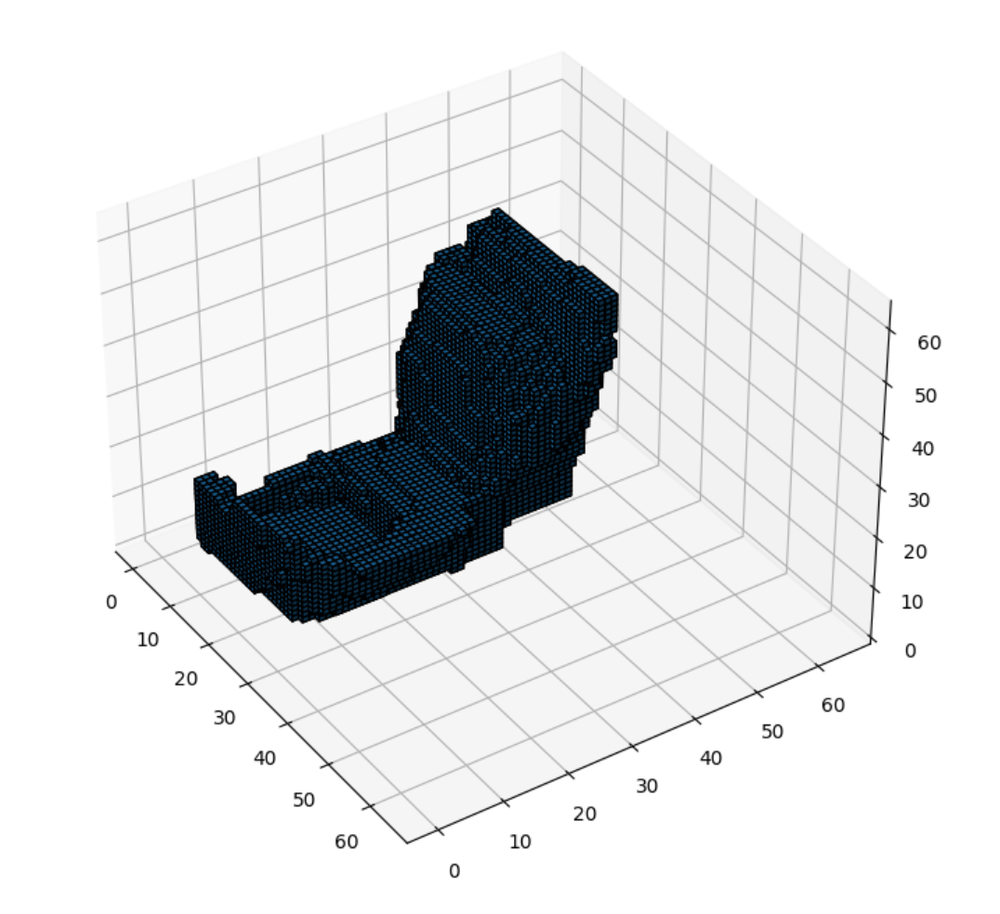
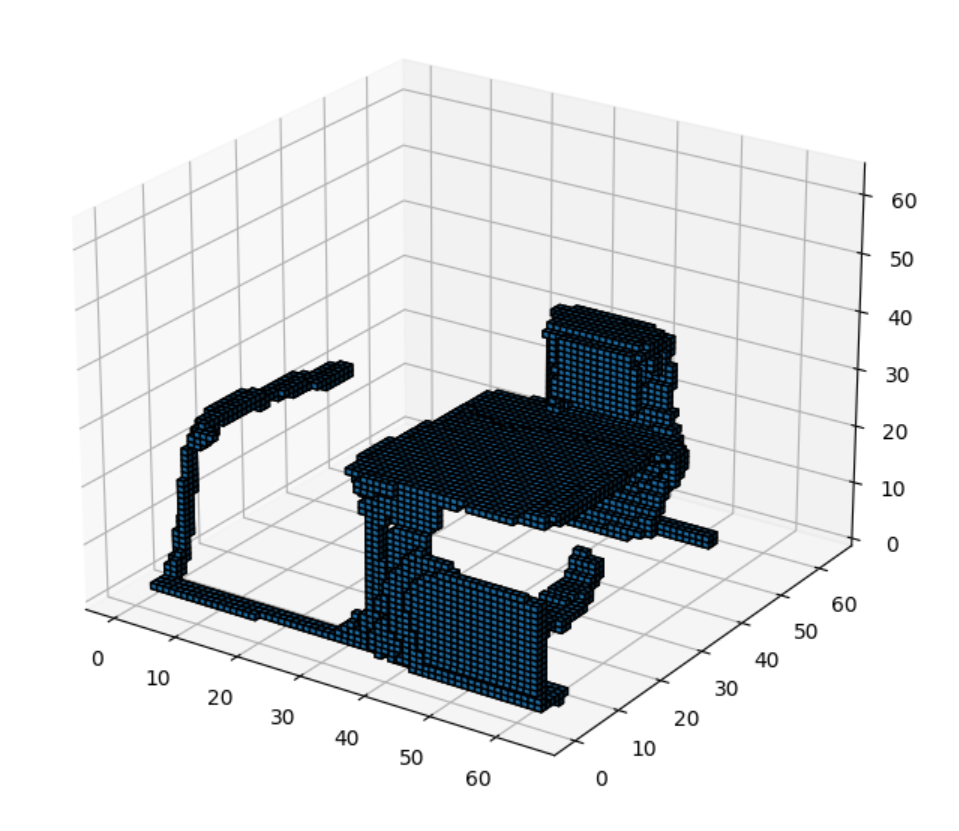

# diffusion_3d_voxel_models
A tool generating 3D voxel models using an improved diffusion model in Python.

--> Sample of CHAIR generation

--> Sample of TOILET generation

--> Sample of DESK generation

